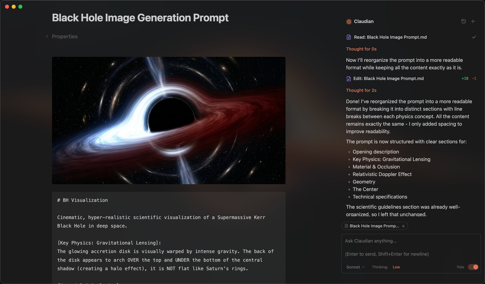

# Vauex

Vauex is a Codex-first Obsidian plugin that brings an AI coding agent into your vault. It uses OpenAI Codex as the default runtime so your notes, docs, prompts, and project files can be read, edited, searched, and refactored from a sidebar inside Obsidian.

Claude provider code is still present during the fork migration, but Claude is hidden from the visible Vauex UI.



## Features

- Codex chat sidebar inside Obsidian
- Inline edit for selected text or cursor context
- Multi-tab conversations with history, resume, fork, and compact support
- Codex skills from `.codex/skills/` and `.agents/skills/`
- Codex subagents from `.codex/agents/`
- Image attachments where supported by the Codex runtime
- Plan mode and permission controls for safer changes
- MCP tools through Codex CLI-managed configuration

## Requirements

- Obsidian 1.4.5 or newer
- Desktop Obsidian on Windows, macOS, or Linux
- Codex CLI installed and authenticated
- A vault you are comfortable letting an agent read and edit

On Windows, Vauex supports native Codex and WSL-based Codex. Configure the launch mode in Settings -> Vauex -> Codex.

## Installation

1. Build or download the release files:
   - `main.js`
   - `manifest.json`
   - `styles.css`
2. Create this folder in your vault:

   ```text
   .obsidian/plugins/vauex/
   ```

3. Copy the three release files into that folder.
4. Restart Obsidian.
5. Enable Vauex in Settings -> Community plugins.

## Development

```bash
npm install
npm run typecheck
npm run build
```

For watch mode:

```bash
npm run dev
```

Optional local copy:

```bash
cp .env.local.example .env.local
```

Set `OBSIDIAN_VAULT` in `.env.local` to copy built files into `.obsidian/plugins/vauex/` during development builds.

## Codex Setup

Vauex auto-detects the Codex CLI from `PATH`. If detection fails:

1. Install and authenticate Codex CLI.
2. Restart Obsidian so it can see the updated environment.
3. Open Vauex settings and set the Codex CLI path manually.
4. On Windows, choose either native Windows or WSL mode.

Native Windows usually points to `codex.exe`. WSL mode expects a Linux command such as `codex` or a Linux absolute path inside the selected distro.

## Privacy

Vauex sends your prompts, selected context, attachments, tool results, and agent-visible vault content to the configured Codex/OpenAI runtime. Vauex does not add telemetry.

Local state currently uses the legacy `.claudian/` storage directory for migration safety. Codex transcripts are stored by Codex under `~/.codex/sessions/`.

## Release Files

Each GitHub release should attach:

- `main.js`
- `manifest.json`
- `styles.css`

The plugin id is `vauex`, so the Obsidian plugin folder must also be named `vauex`.

## Attribution

Vauex is forked from Claudian by Yishen Tu and keeps the original MIT license attribution intact.
